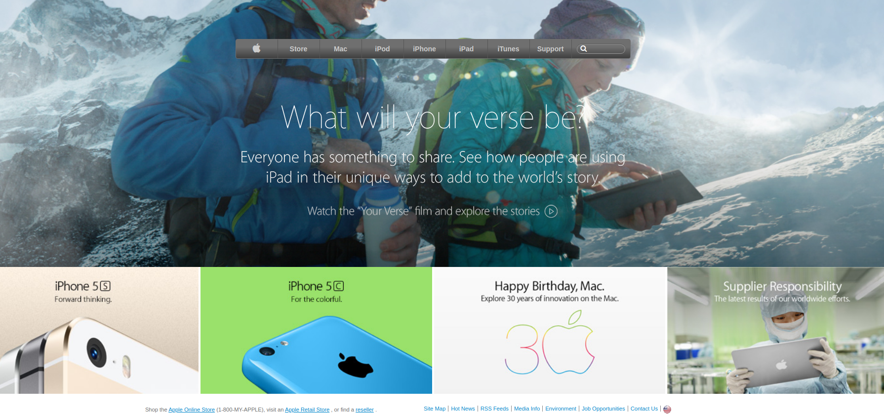

<!-- PROJECT LOGO -->
 

  <!--  -->

  <h3 align="center">Apple Home Page</h3>

  

    Project developed with HTML5 and CSS3 based on Apple Home Page.
     
    <a href="https://github.com/YairFernando67/AppleHomePage"><strong>Explore the docs »</strong></a>
     
     
    <a href="https://github.com/YairFernando67/AppleHomePage/issues">Report Bug</a>
    ·
  

<!-- TABLE OF CONTENTS -->
## Table of Contents

* [About the Project](#about-the-project)
  * [Built With](#built-with)
* [Contact](#contact)
* [Acknowledgements](#acknowledgements)

<!-- ABOUT THE PROJECT -->
## About The Project

This is a Home page of the apple webside

### Built With
The project was developed using these tools and technologies.
* [CSS3](https://developer.mozilla.org/en-US/docs/Web/CSS)
* [HTML5](https://www.w3schools.com/html/)
* [Reset CSS File](https://necolas.github.io/normalize.css/)
* [VSCode](https://code.visualstudio.com/download/)

<!-- CONTACT -->
## Contact

Yair Fernando Facio Fraga - [YairFernando67](https://github.com/YairFernando67) - yair.facio11@gmail.com  

Project Link: [https://github.com/YairFernando67/AppleHomePage](https://github.com/YairFernando67/AppleHomePage)

<!-- ACKNOWLEDGEMENTS -->
## Acknowledgements
* [Normalize.css](https://necolas.github.io/normalize.css/)
* [Microverse](https://www.microverse.org/)

